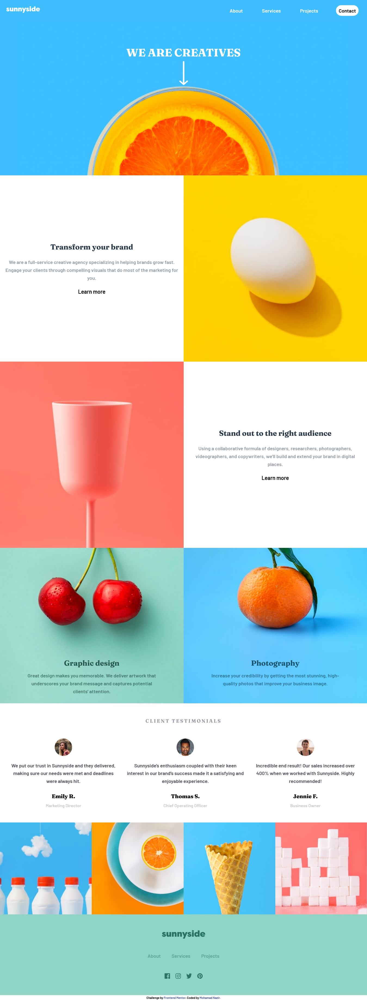

# Frontend Mentor - Sunnyside agency landing page challenge solution

This is a solution to the [Sunnyside agency landing page challenge on Frontend Mentor](https://www.frontendmentor.io/solutions/responsive-intro-component-with-signup-form-IkHEh_1as). Frontend Mentor challenges help you improve your coding skills by building realistic projects.

## Table of contents

- [Overview](#overview)
  - [Screenshot](#screenshot)
  - [Links](#links)
- [My process](#my-process)
  - [Built with](#built-with)
- [Author](#author)

## Overview

### Screenshot

### Links

- Solution URL: [Repository](https://github.com/NAZIRwill29/intro-component-with-signup-form)
- Live Site URL: [Sunnyside agency landing page challenge - Netlify](https://intro-component-with-signup-form-mdnazir.netlify.app/)

## My process

### Built with

- Semantic HTML5 markup
- CSS custom properties
- CSS Grid
- Flexbox
- CSS Animations
- Mobile-first workflow
- SASS

## Author

- Frontend Mentor - [@NAZIRwill29](https://www.frontendmentor.io/profile/NAZIRwill29)
- hashnode - [@Nazzz's Blog](https://mdnazir.hashnode.dev/)